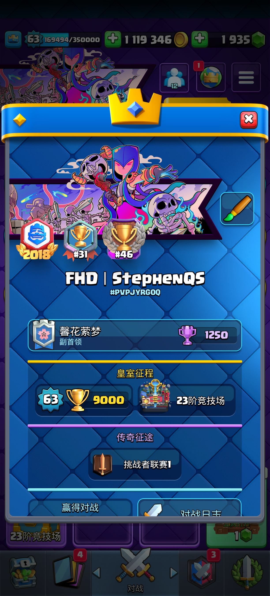
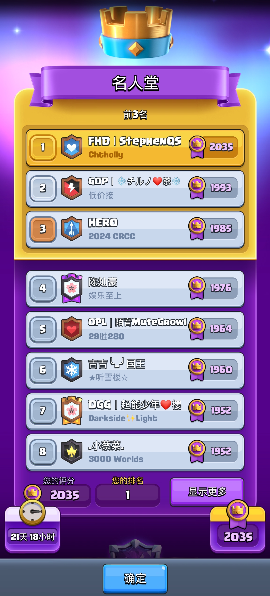
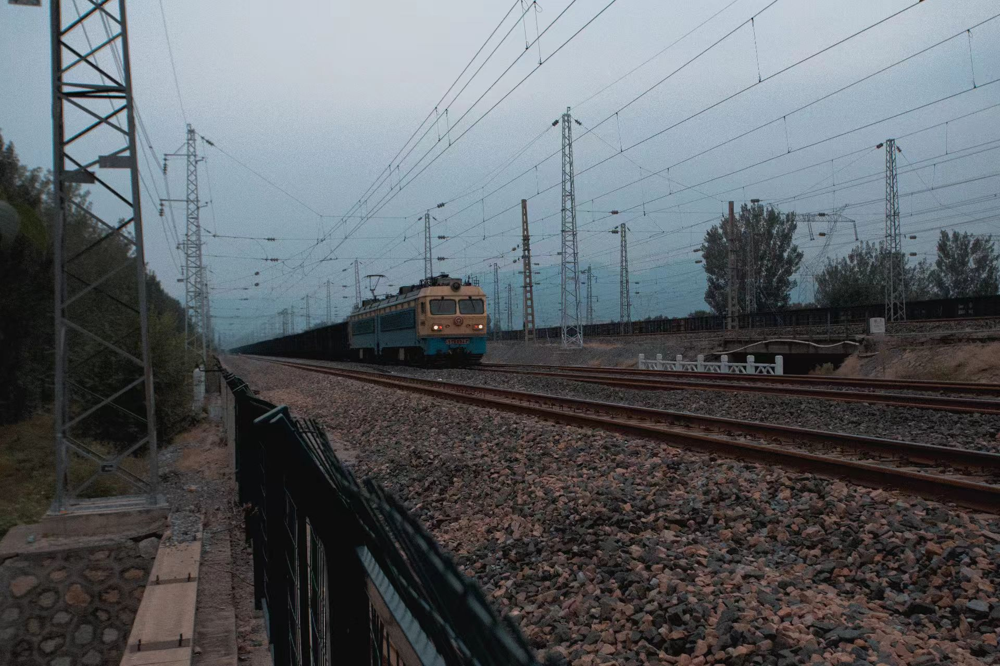
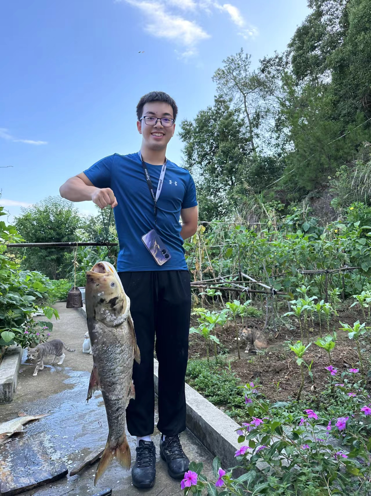

Hi, I'm Shi Qiu (仇是), a senior undergraduate student at the School of Physics, Peking University. 

My research focuses on LLM reasoning and agentic AI. My research explores two fundamental directions: (1) Leveraging high-quality physics knowledge to enhance model reasoning beyond superficial pattern-matching, and (2) Developing and evaluating trustworthy agentic frameworks that demonstrate robust performance in real-world applications.

I am currently an intern with [Prof. Dawn Song](https://dawnsong.io/)'s team at UC Berkeley, and with [Prof. Huaxiu Yao](https://www.huaxiuyao.io)'s team at UNC Chapel Hill, where I contribute to cutting-edge AI research. Additionally, I am affiliated with the AI4Physics research group led by Professors Qing-Hong Cao, Hua-Xing Zhu, and Ming-Xing Luo at the School of Physics, Peking University. Also, I'm honored to be the ONLY undergrad advisor of [AlphaXiv](https://www.alphaxiv.org).

---

# 🔥 News
- **[Nov 2025]** Honored to be the Advisor of [AlphaXiv](https://www.alphaxiv.org)! Keep going for high fidelity research!
- **[Sep 2025]** Honored to receive the **National Scholarship** award! 
- **[Sep 2025]** Our paper, **PHYBench**, **MJ-Video**(selected as Spotlight) and **SuperGPQA** was accepted by **NeurIPS 2025**! See you all in San Diego in December~
- **[Sep 2025]** Our paper, **GLIMPSE**, was accepted as an **Oral Presentation Paper** of **EMNLP 2025 Main Conference**!
- **[May 2025]** We released **PHYBench**, the first large-scale reasoning benchmark within a physical context. Follow us for the latest updates!
- **[Jan 2025]** Our paper, **MMIE**, was accepted by ICLR 2025 as an **Oral** presentation!
- **[Feb 2025]** Our paper, **MJ-Video**, was released on arXiv.
- **[2024]** Honored to receive the Excellence in Research Award for contributions in AI and intelligent systems.

---

# ✉️ Contact
- **X (Twitter):** [@StephenQS0710](https://x.com/StephenQS0710)
- **Hugging Face:** [StarThomas1002](https://huggingface.co/StarThomas1002)
- **Discord:** `stephen_17949`
- **WeChat:** StephenQSqiuqiu
- **小红书:** 是是是一只吃播萨米
- **CV:** [View my Personal CV](https://github.com/StephenQSstarThomas/backup_personal_files/blob/main/qs_cv.pdf)

---

# 📝 Publications

[1] **PHYBench: Holistic Evaluation of Physical Perception and Reasoning in Large Language Models**  
**Shi Qiu**, Shaoyang Guo, Zhuo-Yang Song, Hua-Xing Zhu et al.  
*NeurIPS 2025*  
[[Paper]](https://arxiv.org/abs/2504.16074) [[Project]](https://phybench-official.github.io/phybench-demo/)

[2] **MMIE: Massive Multimodal Interleaved Comprehension Benchmark for Large Vision-Language Models**  
Peng Xia*, Siwei Han*, **Shi Qiu***, Yiyang Zhou, Zhaoyang Wang, Wenhao Zheng, Zhaorun Chen, Chenhang Cui, Mingyu Ding, Linjie Li, Lijuan Wang, Huaxiu Yao  
*ICLR 2025 (Oral)*  
[[Paper]](https://arxiv.org/abs/2410.10139) [[Project]](https://mmie-bench.github.io/)

[3] **Agents: An Open-source Framework for Autonomous Language Agents**  
Wangchunshu Zhou, Yuchen Eleanor Jiang, Long Li, Jialong Wu, **Shi Qiu**, etc.  
*ICLR 2024 Workshop on Large Language Models for Agents*  
[[Paper]](https://arxiv.org/abs/2309.07870) [[Project]](https://github.com/aiwaves-cn/agents)

[4] **GLIMPSE: Do Large Vision-Language Models Truly Think With Videos or Just Glimpse at Them?**  
Yiyang Zhou*, Linjie Li*, **Shi Qiu***, Zhengyuan Yang, Yuyang Zhao, Siwei Han, Yangfan He, Kangqi Li, Haonian Ji, Zihao Zhao, Haibo Tong, Lijuan Wang, Huaxiu Yao  
*EMNLP 2025 Main (Oral)*

[5] **MJ-VIDEO: Fine-Grained Benchmarking and Rewarding Video Preferences in Video Generation**  
Haibo Tong, Zhaoyang Wang, Zhaorun Chen, Haonian Ji, **Shi Qiu**, Siwei Han, Zhongkai Xue, Yiyang Zhou, Peng Xia, Kexin Geng, Mingyu Ding, Rafael Rafailov, Chelsea Finn, Huaxiu Yao  
*NeurIPS 2025 (Spotlight)*   
[[Paper]](https://arxiv.org/abs/2502.01719)

[6] **SuperGPQA: Scaling LLM Evaluation across 285 Graduate Disciplines**  
Xeron Du, Yifan Yao, Kaijing Ma, Bingli Wang, Tianyu Zheng, King Zhu, Minghao Liu, Yiming Liang, Xiaolong Jin, Zhenlin Wei, **Shi Qiu**, ..., Jiaheng Liu, Stephen Huang, Ge Zhang  
*NeurIPS 2025*   
[[Paper]](https://arxiv.org/abs/2502.14739)

# 🎖️ Honors and Awards
- **National Scholarship**, *2025*
- **Excellence in Research Award**, *2024*
- **Peking University Third Class Scholarship**, *2024*
- **Shu Qi Scholarship**, *2023*
- **Youth Award for Athletics**, *2023*

---

# 📖 Education
**Peking University** *Beijing, China* *B.S. in Astronomy, School of Physics* *2022 – Present*
- Overall GPA: 3.64/4.0

---

# 💼 Research Experience

**Undergraduate Researcher** | UNC Chapel Hill  
*Advisor: [Prof. Huaxiu Yao](https://www.huaxiuyao.io)* *June 2024 – Aug 2024*
- Contributed to multiple research projects in large multimodal models and AI agents as a summer research assistant.

**Research Intern** | AIWaves  
*June 2023 – Aug 2023*
- Contributed to the core development of the open-source framework for autonomous language agents.
- Co-authored the paper "Agents: An Open-source Framework for Autonomous Language Agents".
- Project reached over 5,000 stars on GitHub: [[Project Link]](https://github.com/aiwaves-cn/agents)

**CUPT Competition Team** | Peking University  
*March 2023 – May 2023*
- Served as a Main Speaker for the team.
- Awarded Third Prize in the China Undergraduate Physics Tournament (CUPT) school-wide competition.

---

# 💻 Projects

**[CourseCommunity](https://github.com/StephenQSstarThomas/CourseCommunity)** *March 2024 – Present* An open-source, all-for-free platform providing university course notes and self-study guides.

**[LLM Agent Framework](https://github.com/aiwaves-cn/agents)** *June 2023 – Aug 2023* An open-source framework for building and deploying autonomous language agents.

---

# 🗺️ Skills
- **Programming:** Python, LaTeX, Markdown
- **Languages:** Native Mandarin, Fluent English (TOEFL 112, CET-6 696)

---

# 🏸 Extracurricular Activities & Interests

- **President of the Peking University Jump-Rope Team**
  - **Achievements:**
    - **National Online Jump Rope Competition:** Ranked #29.
    - **Beijing College League:** First Place (Men’s 30-Second Double Under), Second Place (Mixed 1-on-1 30-Second Single Under, Broke Event Record), Third Place (Consecutive Triple Under).

- **Member of the Badminton Team in Department of Physics**
  - **Achievement:** Contributed to the team's 3rd place victory in the Beijing University Cup Badminton Team Competition.

- **Class Monitor**, Class 8 of the 22nd Undergraduate Cohort
  - Managed class responsibilities, organized events, and facilitated communication between students and faculty.

- **Key Member of the Peking University Blockchain Association**
  - Actively engaged in discussions on blockchain technology and its applications.

- **Literature & Writing**
  - Published a personal collection of essays, available at my [[Literature]](https://github.com/StephenQSstarThomas/Literature) repository.
  - **Favorite Authors:** [Richard Powers](https://richardpowers.net), [Amor Towles](https://www.amortowles.com), and [Anthony Doerr](https://www.anthonydoerr.com).

- **Photography**
  - Collaborated with Mengshu Yu and Dannni Luo to create a unique series of self-made postcards. View them here: [[Postcards]](https://github.com/StephenQSstarThomas/Postcards).
   
  
   

- **Games**
  - **Clash Royale:**
    - Achieved Ladder rank #31 and Tournament rank #46 on the Chinese Server. Reached #1 using Evo RG ([video proof](https://www.bilibili.com/video/BV1CS411K7nU)).
    - Won 3rd place in the Clash Royale Chinese University League (CRCUL) with teammates Yikai Zhu, Hao Chen, and others.
     
    

        
        
    

     
  - **Battle of Balls:**
    - Ranked #7 on the ladder in Zhejiang Province, July 2018.

- **Hobbies**
  - **Trains:** A passionate train enthusiast.
     
    
     
  - **Fishing:** Enjoy fishing during my leisure time.
     
    
     
